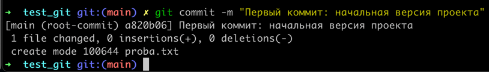

# Тема 7. Работа с файлами (ввод, вывод)
Отчет по Теме #7 выполнил:
- Гребенщиков Евгений Олегович
- ИНО ОЗБ ПОАС-22-2

| Задание    | Сам_раб |
|------------|---------|
| Задание 1  | +       |
| Задание 2  | +       |
| Задание 3  | +       |
| Задание 4  | +       |
| Задание 5  | +       |

знак "+" - задание выполнено; знак "-" - задание не выполнено;

Работу проверили:
- к.э.н., доцент Панов М.А.

## Самостоятельная работа №1
### Найдите в интернете любую статью (объем статьи не менее 200 слов), скопируйте ее содержимое в файл и напишите программу, которая считает количество слов в текстовом файле и определит самое часто встречающееся слово. Результатом выполнения задачи будет: скриншот файла со статьей, листинг кода, и вывод в консоль, в котором будет указана вся необходимая информация

```python
from collections import Counter
import re


def count_words_and_find_most_frequent(file_path):
    with open(file_path, 'r') as file:
        text = file.read().lower()
        words = re.findall(r'\b\w+\b', text)
        word_count = len(words)
        most_common_word, frequency = Counter(words).most_common(1)[0]

        return word_count, most_common_word, frequency


file_path = 'habr.txt'
word_count, most_common_word, frequency = count_words_and_find_most_frequent(file_path)
print(f'Всего слов: {word_count}')
print(f'Самое часто встречающееся слово: "{most_common_word}" попадается {frequency} раз')

```
### Результат


## Самостоятельная работа №2
### У вас появилась потребность в ведении книги расходов, посмотрев все существующие варианты вы пришли к выводу что вас ничего не устраивает и нужно все делать самому. Напишите программу для учета расходов. Программа должна позволять вводить информацию о расходах, сохранять ее в файл и выводить существующие данные в консоль. Ввод информации происходит через консоль. Результатом выполнения задачи будет: скриншот файла с учетом расходов, листинг кода, и вывод в консоль, с демонстрацией работоспособности программы

```python
import json


def load_expenses(filename):
    try:
        with open(filename, 'r') as file:
            return json.load(file)
    except FileNotFoundError:
        return []


def save_expenses(expenses, filename):
    with open(filename, 'w') as file:
        json.dump(expenses, file, indent=4)


def add_expense(expenses):
    description = input("Описание траты: ")
    amount = float(input("Введите сумму траты: "))
    expenses.append({"description": description, "amount": amount})


def display_expenses(expenses):
    print("Текущие траты:")
    for expense in expenses:
        print(f"Описание: {expense['description']}, Сумма: {expense['amount']}")


def main():
    filename = 'expenses.json'
    expenses = load_expenses(filename)

    while True:
        print("\n1. Добавить расход")
        print("2. Показать траты")
        print("3. Выйти из приложения")
        choice = input("Выберите действие: ")

        if choice == '1':
            add_expense(expenses)
            save_expenses(expenses, filename)
        elif choice == '2':
            display_expenses(expenses)
        elif choice == '3':
            break
        else:
            print("Неверный выбор, пожалуйста, попробуйте снова.")


if __name__ == "__main__":
    main()

```
### Результат


## Самостоятельная работа №3
### Имеется файл input.txt с текстом на латинице. Напишите программу, которая выводит следующую статистику по тексту: количество букв латинского алфавита; число слов; число строк
* Текст в файле:
### Beautiful is better than ugly.
### Explicit is better than implicit.
### Simple is better than complex.
### Complex is better than complicated.
* Ожидаемый результат:
### Input file contains:
### 108 letters
### 20 words
### 4 lines


```python
def analyze_text(filename):
    letter_count = 0
    word_count = 0
    line_count = 0

    with open(filename, 'r') as file:
        for line in file:
            line_count += 1
            word_count += len(line.split())
            letter_count += sum(1 for char in line if char.isalpha())

    result = f"Input file contains:\n{letter_count} letters\n{word_count} words\n{line_count} lines"
    print(result)

    
if __name__ == "__main__":
    analyze_text('input.txt')
```
### Результат


## Самостоятельная работа №4
### Напишите программу, которая получает на вход предложение, выводит его в терминал, заменяя все запрещенные слова звездочками * (количество звездочек равно количеству букв в слове). Запрещенные слова, разделенные символом пробела, хранятся в текстовом файле input.txt. Все слова в этом файле записаны в нижнем регистре. Программа должна заменить запрещенные слова, где бы они ни встречались, даже в середине другого слова. Замена производится независимо от регистра: если файл input.txt содержит запрещенное слово exam, то слова exam, Exam, ExaM, EXAM и exAm должны быть заменены на ****.
* Запрещенные слова:
### hello email python the exam wor is
* Предложение для проверки:
### Hello, world! Python IS the programming language of thE future. My
### EMAIL is....
### PYTHON is awesome!!!!
* Ожидаемый результат:
### *****, ***ld! ****** ** *** programming language of *** future. My
### ***** **....
### ****** ** awesome!!!!

```python
def load_banned_words(file_path):
    with open(file_path, 'r') as file:
        return file.read().split()

def replace_banned_words(sentence, banned_words):
    replaced_sentence = sentence
    for banned_word in banned_words:
        replaced_sentence = replaced_sentence.replace(banned_word.lower(), '*' * len(banned_word))
        replaced_sentence = replaced_sentence.replace(banned_word.capitalize(), '*' * len(banned_word))
        replaced_sentence = replaced_sentence.replace(banned_word.upper(), '*' * len(banned_word))
    return replaced_sentence

def main():
    banned_words = load_banned_words('banned_words.txt')
    sentence = "Hello, world! Python IS the programming language of thE future. My EMAIL is.... PYTHON is awesome!!!!"
    replaced_sentence = replace_banned_words(sentence, banned_words)
    print(replaced_sentence)

if __name__ == "__main__":
    main()
```
### Результат


## Самостоятельная работа №5
### Самостоятельно придумайте и решите задачу, которая будет взаимодействовать с текстовым файлом.
### Создайте текстовый файл tasks.txt, который будет хранить задачи.
### Напишите скрипт на Python, который позволит пользователю:
* Добавлять новые задачи.
* Удалять задачи по номеру.
* Просматривать все задачи.
* Закончить работу с программой и сохранить изменения.

```python
def count_words(file_path):
    with open(file_path, 'r') as file:
        content = file.read()
        words = content.split()
        return len(words)


def main():
    file_path = input("Введите путь к текстовому файлу: ")
    word_count = count_words(file_path)
    if word_count != -1:
        print(f"Количество слов в файле '{file_path}': {word_count}")


if __name__ == "__main__":
    main()
```

### Результат
