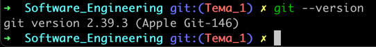
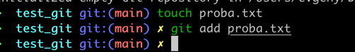
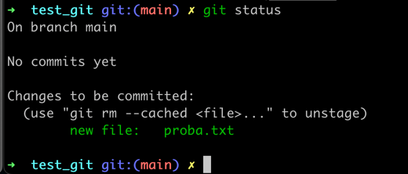
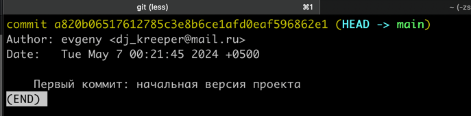
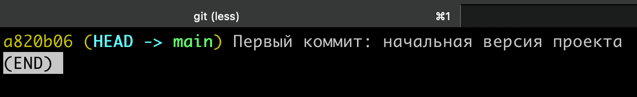
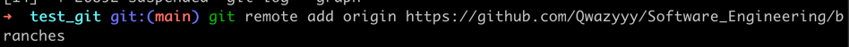

# Тема 1. Работа с репозиториями.
Отчет по Теме #1 выполнил:
- Гребенщиков Евгений Олегович
- ИНО ОЗБ ПОАС-22-2

| Задание    | Сам_раб |
|------------|---------|
| Задание 1  | +       |
| Задание 2  | +       |
| Задание 3  | +       |
| Задание 4  | +       |
| Задание 5  | +       |
| Задание 6  | +       |
| Задание 7  | +       |
| Задание 8  | +       |
| Задание 9  | +       |
| Задание 10 | +       |
| Задание 11 | +       |
| Задание 12 | +       |
| Задание 13 | +       |
| Задание 14 | +       |
| Задание 15 | +       |

знак "+" - задание выполнено; знак "-" - задание не выполнено;

Работу проверили:
- к.э.н., доцент Панов М.А.

## Задание №1 Установка

### Результат

## Задание №2 Настройка

### Результат

## Задание №3 Создание нового репозитория

### Результат

## Задание №4 Подготовка файлов

### Результат

## Задание №5 Фиксация изменений

### Результат

## Задание №6 Подключение к удаленному репозиторию

### Результат

## Задание №7 Ветвление

### Результат

## Задание №8 Особенности применения «Фетч»

### Результат

## Задание №9 Удаление файлов, веток, локальных и удалённых репозиториев

### Результат

## Задание №10 Отслеживание изменений в коммитах

### Результат

## Задание №11 Возвращение файла к предыдущему (определенному) состоянию

### Результат

## Задание №12 Возвращение к предыдущему коммиту

### Результат

## Задание №13 Исправление коммита

### Результат

## Задание №14 Разрешение конфликтов при слиянии

### Результат

## Задание №15 Настройка. gitignore

### Результат
