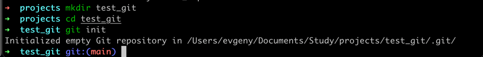

# Тема 10. Декораторы и исключения
Отчет по Теме #10 выполнил:
- Гребенщиков Евгений Олегович
- ИНО ОЗБ ПОАС-22-2

| Задание   | Сам_раб |
|-----------|---------|
| Задание 1 | +       |
| Задание 2 | +       |
| Задание 3 | +       |
| Задание 4 | +       |
| Задание 5 | +       |

знак "+" - задание выполнено; знак "-" - задание не выполнено;

Работу проверили:
- к.э.н., доцент Панов М.А.

## Самостоятельная работа 1
### Вовочка решил заняться спортивным программированием на python, но для этого он должен знать за какое время выполняется его программа. Он решил, что для этого ему идеально подойдет декоратор для функции, который будет выяснять за какое время выполняется та или иная функция. Помогите Вовочке в его начинаниях и напишите такой декоратор. Подсказка: необходимо использовать модуль time Декоратор необходимо использовать для этой функции:

### Результатом вашей работы будет листинг кода и скриншот консоли, в котором будет выполненная функция Фибоначчи и время выполнения программы. Также на этом примере можете посмотреть, что решение задач через рекурсию не всегда является хорошей идеей. Поскольку решение Фибоначчи для 100 с использованием рекурсии и без динамического программирования решается более десяти секунд, а решение точно такой же задачи, но через цикл for еще и для 200, занимает меньше 1 секунды.

```python
import time


def calculate_time(func):
    def wrapper(*args, **kwargs):
        start_time = time.time()
        result = func(*args, **kwargs)
        end_time = time.time()
        print(f"Функция {func.__name__} выполнена за : {end_time - start_time} секунд")
        return result

    return wrapper


@calculate_time
def fibonacci():
    fib1 = fib2 = 1

    for i in range(2,200):
        fib1, fib2 = fib2, fib1 + fib2
        print(fib2, end='')

    print("\n")


if __name__ == "__main__":
    result = fibonacci()

```
### Результат


## Самостоятельная работа 2
### Посмотрев на Вовочку, вы также загорелись идеей спортивного программирования, начав тренировки вы узнали, что для решения некоторых задач необходимо считывать данные из файлов. Но через некоторое время вы столкнулись с проблемой что файлы бывают пустыми, и вы не получаете вводные данные для решения задачи. После этого вы решили не просто считывать данные из файла, а всю конструкцию оборачивать в исключения, чтобы избежать такой проблемы. Создайте пустой файл и файл, в котором есть какая-то информация. Напишите код программы. Если файл пустой, то, нужно вызвать исключение (“бросить исключение”) и вывести в консоль “файл пустой”, а если он не пустой, то вывести информацию из файла.

```python
# Создание пустого файла
with open("empty.txt", "w") as empty_file:
    pass

# Создание файла с информацией
with open("text.txt", "w") as file_with_info:
    file_with_info.write("Какой то текст")


# Проверка содержимого файлов
def check_file_content(filename):
    try:
        with open(filename, "r") as file:
            content = file.read()
            if not content:
                raise Exception("Файл пустой")
            else:
                print(content)
    except Exception as e:
        print(e)


# Проверка пустого файла
check_file_content("empty.txt")

# Проверка файла с информацией
check_file_content("text.txt")

```
### Результат


## Самостоятельная работа 3
### Напишите функцию, которая будет складывать 2 и введенное пользователем число, но если пользователь введет строку или другой неподходящий тип данных, то в консоль выведется ошибка “Неподходящий тип данных. Ожидалось число.”. Реализовать функционал программы необходимо через try/except и подобрать правильный тип исключения. Создавать собственное исключение нельзя. Проведите несколько тестов, в которых исключение вызывается и нет. Результатом выполнения задачи будет листинг кода и получившийся вывод в консоль

```python
def add_two(user_input):
    try:
        result = 2 + int(user_input)
        print(f"Введенное число + 2: {result}")
    except ValueError:
        print("Неподходящий тип данных. Ожидалось число.")


add_two(input("Введите число: "))
add_two(input("Введите число: "))
add_two(input("Введите число: "))

```
### Результат


## Самостоятельная работа 4
### Создайте собственный декоратор, который будет использоваться для двух любых вами придуманных функций. Декораторы, которые использовались ранее в работе нельзя воссоздавать. Результатом выполнения задачи будет: класс декоратора, две как-то связанными с ним функциями, скриншот консоли с выполненной программой и подробные комментарии, которые будут описывать работу вашего кода.

```python
class MyDecorator:
    def __init__(self, *args, **kwargs):
        pass

    def __call__(self, func):
        # Внутри метода __call__ создаем обертку (wrapper), которая принимает все аргументы, которые были переданы в функцию, декорированную этим декоратором
        def wrapper(*args, **kwargs):
            # Выводим сообщение о том, что декоратор запущен перед выполнением функции
            print(f"Декоратор запущен перед выполнением функции {func.__name__}")
            # Вызываем функцию, которую декорируем, передавая ей все аргументы, которые были переданы в нее
            result = func(*args, **kwargs)
            # Выводим сообщение о том, что декоратор запущен после выполнения функции
            print(f"Декоратор запущен после выполнения функции {func.__name__}")
            # Возвращаем результат выполнения функции
            return result

        # Возвращаем обертку в качестве результата вызова декоратора
        return wrapper


# Применяем декоратор к функциям function1 и function2
@MyDecorator()
def function1():
    # Выполняем код функции
    print("Выполняется функция function1")

@MyDecorator()
def function2():
    # Выполняем код функции
    print("Выполняется функция function2")

# Вызываем функции, которые были декорированы этим декоратором
function1()
function2()
```
### Результат


## Самостоятельная работа 5
### Создайте собственное исключение, которое будет использоваться в двух любых фрагментах кода. Исключения, которые использовались ранее в работе нельзя воссоздавать. Результатом выполнения задачи будет: класс исключения, код к котором в двух местах используется это исключение, скриншот консоли с выполненной программой и подробные комментарии, которые будут описывать работу вашего кода.

```python
class MyCustomException(Exception):
    def __init__(self):
        super().__init__("Деление на ноль невозможно")


def divide(a, b):
    if b == 0:
        raise MyCustomException()
    return a / b


def calculate_sum(numbers):
    try:
        sum = 0
        for num in numbers:
            sum += divide(num, 0)
    except MyCustomException as e:
        print(f"Произошла ошибка: {e}")
    else:
        print(f"Сумма чисел: {sum}")


def user_divide():
    try:
        a = int(input("Введите первое число: "))
        b = int(input("Введите второе число: "))
        result = divide(a, b)
    except MyCustomException as e:
        print(f"Произошла ошибка: {e}")
    else:
        print(f"Результат деления: {result}")


numbers = [1, 2, 3, 4, 5]
calculate_sum(numbers)
user_divide()

```
### Результат
